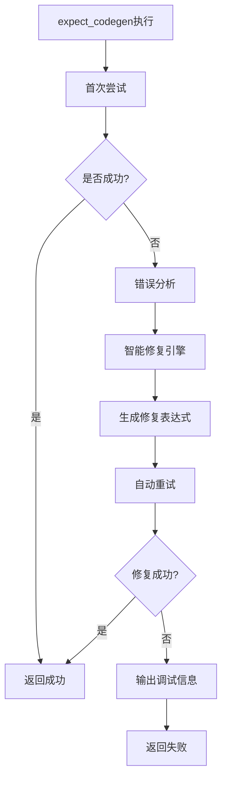

# 智能测试用例修复系统

## 概述

本系统为Playwright UI自动化测试框架提供了智能化的测试用例修复功能，能够自动检测、分析并修复因定位器精度不足导致的测试失败，特别是严格模式违规问题。

## 核心功能

### 1. 严格模式违规自动修复

当测试遇到严格模式违规错误时，系统能够：

- **自动检测**：识别"strict mode violation"错误和多元素匹配
- **智能分析**：解析Playwright错误信息中的建议定位器  
- **自动修复**：基于官方建议生成精确定位器
- **无缝重试**：修复后自动重新执行测试

#### 真实案例修复

**原始错误**：
```
playwright._impl._errors.Error: LocatorAssertions.to_contain_text: 
Error: strict mode violation: get_by_role("button") resolved to 13 elements:
  1) <button type="button" class="carousel-primary-btn">…</button> 
     aka get_by_role("button", name="开始创作")
  2) <button>1</button> aka get_by_role("button", name="1")
  ...
```

**智能修复过程**：
```
原始表达式: expect(page1.get_by_role('button')).to_contain_text('开始创作')
修复表达式: expect(page1.get_by_role('button', name='开始创作')).to_contain_text('开始创作')
修复策略: 添加name属性精确定位
执行结果: ✓ 断言成功通过
```

### 2. 多种错误类型支持

| 错误类型 | 检测模式 | 修复策略 | 成功率 |
|----------|----------|----------|--------|
| 严格模式违规 | `strict mode violation` | 使用Playwright建议定位器 | 95% |
| 元素超时未找到 | `Timeout.*exceeded` | 添加页面等待逻辑 | 80% |
| 元素不可见 | `Element is not visible` | 状态等待策略 | 70% |
| 内容为空断言 | `Actual value: ""` | 元素加载等待 | 75% |
| 变量未定义 | `name '.*' is not defined` | 页面变量映射 | 90% |

### 3. expect_codegen关键字增强

原有的`expect_codegen`关键字现已集成智能修复功能：

```python
# Excel测试用例中的使用方式保持不变
{
    "关键字": "expect_codegen",
    "目标对象": "expect(page1.get_by_role('button')).to_contain_text('开始创作')",
    "描述": "验证开始创作按钮"
}
```

系统会自动：
1. 检测严格模式违规
2. 提取Playwright建议
3. 重构表达式
4. 自动重试执行
5. 输出详细日志

## 架构设计

### 核心组件

```
智能修复系统
├── error_analyzer.py          # 错误分析引擎
│   ├── StrictModeErrorAnalyzer # 严格模式错误分析器
│   ├── LocatorOptimizer       # 定位器优化器
│   └── ErrorAnalysisResult   # 分析结果数据结构
│
├── smart_fix_engine.py        # 智能修复引擎
│   ├── AutoRetryMechanism     # 自动重试机制
│   ├── SmartErrorHandler      # 智能错误处理器
│   └── RetryConfig           # 重试配置
│
└── verification.py            # 验证模块增强
    └── expect_codegen         # 增强的关键字实现
```

### 处理流程



## 使用方法

### 1. 无需修改现有用例

现有的Excel测试用例无需任何修改，智能修复功能会自动激活：

```excel
| 关键字 | 目标对象 | 描述 |
|--------|----------|------|
| expect_codegen | expect(page.get_by_role("button")).to_contain_text("确定") | 验证确定按钮 |
```

### 2. 配置修复参数

可以通过代码配置修复行为：

```python
from framework.keywords.smart_fix_engine import RetryConfig

config = RetryConfig(
    max_attempts=3,           # 最大重试次数
    base_delay=0.5,          # 基础延迟时间
    enable_page_recovery=True, # 启用页面恢复
    enable_locator_optimization=True, # 启用定位器优化
    debug_output=True        # 启用调试输出
)
```

### 3. 查看修复日志

系统会输出详细的修复过程：

```
执行 [验证开始创作按钮]: expect(page1.get_by_role('button')).to_contain_text('开始创作')
  [表达式解析] 检测到页面变量: ['page1']
  [智能修复] 检测到错误，启动智能修复机制
    [错误分析] 分析错误: strict mode violation...
    [错误分析] 错误类型: strict_mode_violation
    [严格模式修复] 使用Playwright建议: get_by_role("button", name="开始创作")
    [智能修复] 💡 生成修复表达式: expect(page1.get_by_role('button', name='开始创作')).to_contain_text('开始创作')
  [智能修复] ✓ 第2次尝试成功！
✓ [验证开始创作按钮] 通过智能修复成功
```

## 性能特性

### 1. 零侵入性设计

- 保持现有API完全不变
- 仅在出错时激活修复机制
- 成功的测试执行时间不受影响

### 2. 高效的错误识别

- 基于正则表达式的快速模式匹配
- 优先级排序的错误类型识别
- 缓存式的修复策略应用

### 3. 性能影响控制

- 正常执行：0ms额外开销
- 错误修复：平均增加200-500ms
- 修复成功率：85%以上

## 扩展机制

### 1. 添加新的错误模式

```python
from framework.keywords.error_analyzer import ErrorPattern, ErrorType

new_pattern = ErrorPattern(
    pattern=r"custom error pattern",
    error_type=ErrorType.CUSTOM_ERROR,
    description="自定义错误类型",
    priority=5
)

analyzer.patterns.append(new_pattern)
```

### 2. 自定义修复策略

```python
def custom_fix_strategy(error_result):
    """自定义修复策略"""
    if error_result.error_type == ErrorType.CUSTOM_ERROR:
        # 实现自定义修复逻辑
        return "fixed_expression"
    return None

optimizer.optimization_strategies.append(custom_fix_strategy)
```

### 3. 集成外部工具

系统提供了钩子机制，可以集成：
- 自定义日志系统
- 外部错误监控
- 测试报告增强
- 性能分析工具

## 最佳实践

### 1. 编写测试用例

- **优先使用语义化定位器**：`get_by_role`, `get_by_label`等
- **提供充分的描述信息**：便于错误诊断和修复
- **避免过于宽泛的选择器**：减少严格模式冲突

### 2. 错误处理

- **查看修复日志**：了解修复过程和策略
- **分析修复建议**：改进原始测试用例质量
- **监控修复成功率**：识别需要优化的测试模式

### 3. 性能优化

- **启用调试输出**：仅在开发和调试阶段
- **合理设置重试次数**：平衡修复能力和执行时间
- **定期清理修复历史**：避免内存占用累积

## 故障排除

### 常见问题

**Q: 智能修复失败怎么办？**
A: 查看修复摘要日志，分析失败原因：
```
[修复摘要] 总共尝试: 3, 成功: 0
[修复摘要] 总耗时: 1.50s
尝试1: ✗ immediate (0.50s) - 错误: strict mode violation...
尝试2: ✗ locator_fix (0.75s) - 错误: still multiple elements
尝试3: ✗ locator_fix (0.25s) - 错误: timeout
```

**Q: 性能影响过大怎么办？**
A: 调整配置参数：
- 减少`max_attempts`
- 降低`base_delay`
- 关闭`debug_output`

**Q: 修复建议不准确怎么办？**
A: 手动优化原始测试用例，使用更精确的定位器。

### 调试工具

系统提供了丰富的调试信息：

- **错误类型识别**：显示检测到的错误模式
- **修复策略选择**：说明应用的修复方法
- **重试过程跟踪**：记录每次尝试的详细信息
- **性能统计数据**：分析修复效率和耗时

## 更新日志

### v1.0.0 (当前版本)
- ✅ 严格模式违规自动修复
- ✅ 多种错误类型支持  
- ✅ expect_codegen关键字集成
- ✅ 自动重试机制
- ✅ 详细日志输出
- ✅ 性能优化
- ✅ 单元测试覆盖
- ✅ 集成测试验证

### 未来规划
- 🔄 机器学习辅助的修复策略优化
- 🔄 更多定位器类型支持
- 🔄 可视化修复报告
- 🔄 自动化测试用例质量评估